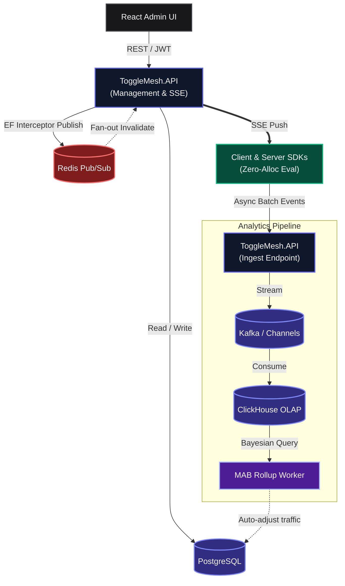

<div align="center">
  
  <h1>ToggleMesh</h1>
  <p><b>Enterprise Feature Flag & Contextual Experimentation Engine</b></p>
  <p>A high-performance, data-private, self-hosted alternative to LaunchDarkly and Statsig. Powered by .NET Core, featuring native SDKs for C#, Python, Go, Node.js, and C++.</p>
</div>

<p align="center">
  
  <a href="https://github.com/sdwck/ToggleMesh/actions/workflows/publish_sdk.yml"></a>
  
  
  
  
</p>

**  
*Manage environments, targeting rules, and A/B tests from a unified, modern interface.*

---

## 📖 What is ToggleMesh?

ToggleMesh is a self-hosted feature management and experimentation platform designed for teams that require strict data privacy, enterprise-grade RBAC, and ultra-low latency. 

Unlike SaaS providers that charge by MAU or require your application to make network calls for flag evaluation, ToggleMesh pushes configurations directly to your servers. Your SDKs evaluate rules **locally in memory**, ensuring zero network overhead and keeping 100% of your user context within your private infrastructure.

### How it compares

| Feature | ToggleMesh | LaunchDarkly | Statsig | Unleash |
|---|:---:|:---:|:---:|:---:|
| **Full Self-Hosting** | ✅ | ❌ *(Relay only)* | ❌ | ✅ |
| **Data Privacy (No PII leaves network)** | ✅ | ❌ | ❌ | ✅ |
| **Zero-Allocation Eval (.NET)**| ✅ | ❌ | ❌ | ❌ |
| **Built-in MAB A/B Tests** | ✅ | ❌ | ✅ | ❌ |
| **Real-Time Push** | ✅ *(SSE)* | ✅ | ✅ | ⚠️ *(Polling)* |
| **Pricing** | **Free (MIT)** | Per-seat | Per-MAU | Freemium |

## 🏗️ Architecture


*Control Plane mutates state -> Interceptor triggers Redis Pub/Sub -> API fans out SSE to connected SDKs.*

---

## 👨‍💻 Quick Start

> **Prerequisite:** A running ToggleMesh server instance. See [Self-Hosting & Deployment](#-self-hosting--deployment) to spin one up locally in under a minute.

### Step 0: Install the Tools
Install the C# SDK and the Global CLI tool:
```bash
dotnet add package ToggleMesh.SDK
dotnet tool install --global ToggleMesh.CLI
```

### Step 1: Zero-Config Context Injection
Register the SDK in your DI container. ToggleMesh can automatically hook into your ambient `HttpContext` to extract user identity, emails, and roles without manual context passing.

```csharp
// Program.cs
builder.Services.AddToggleMeshClient(options => 
{
    options.BaseUrl = "https://api.togglemesh.dev"; // Your self-hosted Control Plane
    options.ApiKey = "tm_server_xxxxxxxx";
}).AddToggleMeshHttpContext(); 
```

### Step 2: Sync Constants & Evaluate
Sync your flags to generate type-safe constants, then evaluate them in your business logic.

```bash
$ togglemesh config
$ togglemesh sync
✔ Success! Auto-detected C# project. Generated ToggleMeshFlags.g.cs
```

```csharp
// CheckoutService.cs
public void ProcessOrder(IToggleMeshClient toggleMesh) 
{
    // Evaluates instantly from in-memory cache. Zero HTTP requests made.
    if (toggleMesh.IsEnabled(Flags.NewCheckoutFlow)) 
    {
        ExecuteNextGenGateway();
    }
}
```

---

## ⚡ Performance & Benchmarks

ToggleMesh is engineered for ultra-low-latency microservices where Garbage Collection (GC) pauses are unacceptable.

By leveraging compiled Expression Trees, pre-computed rule groups, C# Source Generators, and `readonly ref struct` contexts, the ToggleMesh SDK achieves **zero-allocation evaluation**.

### BenchmarkDotNet Results
*We benchmarked various scenarios: from a simple global toggle to a worst-case scenario evaluating 10 nested AND/OR targeting rules.*

| Method | Mean | StdDev | Max | P95 | Allocated |
| :--- | :---: | :---: | :---: | :---: | :---: |
| **Evaluate_NoRules_AOT** *(Baseline)* | **7.43 ns** | 0.04 ns | 7.50 ns | 7.48 ns | **-** |
| **Evaluate_1Rule_AOT** *(Typical)* | **29.53 ns** | 0.11 ns | 29.67 ns | 29.66 ns | **-** |
| **Evaluate_ComplexRule_AOT** *(MAB/Rollout)* | **96.66 ns** | 0.48 ns | 97.69 ns | 97.47 ns | **-** |
| **Evaluate_10Rules_AOT** *(Worst-case)* | **114.23 ns** | 0.38 ns | 114.94 ns | 114.76 ns | **-** |
| **TrackEvent_10Rules_AOT** *(Metrics Buffer)*| **45.84 ns** | 0.06 ns | 45.98 ns | 45.93 ns | **-** |

> **Hardware Specs:** Intel Core i7-14700K, 20 Physical Cores, Windows 11 x64, .NET 10.0 Release Build.

### Extreme High-Throughput (Load Testing)

ToggleMesh decouples heavy I/O operations from the HTTP request-response cycle using **bounded in-memory channels** (`System.Threading.Channels`) with `DropOldest` backpressure. 

Local load testing via [k6](https://k6.io/) on a single developer workstation demonstrates the massive throughput capabilities of the Data Plane API. 

| Endpoint | Type | Target VUs | Max RPS | p(99) Tail Latency | Error Rate |
|---|---|---:|---:|---:|---:|
| `POST /api/v1/sdk/metrics` | **Fire & Forget** (Channel) | 2,000 | **115,248/s** | 18.59 ms | 0.00% |
| `POST /api/v1/sdk/evaluate` | **Synchronous** (Compute) | 2,000 | **112,503/s** | 19.22 ms | 0.00% |
| `POST /api/v1/sdk/events` | **Buffered + Livetail** (SSE) | 2,000 | **68,301/s** | 34.58 ms | 0.00% |
| `GET /api/v1/sdk/flags` | **Synchronous** (I/O Cache) | 2,000 | **68,463/s** | 36.06 ms | 0.00% |

> **Test Environment:** Intel Core i7-14700K, `k6` running locally against Kestrel (Release mode, HTTP). All tests maintained a flawless 0.00% failure rate under sustained load. Data payload bandwidth maxed out at ~179 MB/s during sync.

---

## 💻 Ecosystem & Supported SDKs

ToggleMesh provides native SDKs and tooling for your entire microservice fleet.

| Language / Platform | SDK Type | Real-Time Sync | Targeting Evaluation | Maturity |
| :--- | :--- | :---: | :---: | :---: |
| **.NET (C#)** | Server | ✅ (SSE) | Local (Zero-Alloc) | Stable |
| **Node.js** | Server | ✅ (SSE) | Local | Beta |
| **Browser JS / React** | Client | ✅ (SSE) | Remote (Secure) | Beta |
| **Python** | Server | ✅ (SSE) | Local | Beta |
| **Go** | Server | ✅ (SSE) | Local | MVP |
| **Unreal Engine (C++)** | Game Client | 🔄 (Polling) | Remote | MVP |

---

## 🏢 Enterprise-Grade Features

- 📡 **Push, Not Pull (SSE + Redis):** Real-time cache invalidation using Server-Sent Events. No wasteful HTTP polling.
- 🎯 **Advanced Targeting Engine:** Individual user overrides, Contextual Percentage Rollouts, and Semantic Versioning (SemVer) operators synchronized across all supported SDKs.
- 🎛️ **Multivariate Flags & Remote Config:** Move beyond simple booleans. Serve strongly-typed JSON, strings, or numeric payloads dynamically to your clients, enabling complex UI theming, game balancing, and multi-variant A/B/C testing without deploying new code.
- 🧠 **Contextual Multi-Armed Bandits (MAB):** Built-in Bayesian inference engine (Monte Carlo simulations via Beta distributions). Autonomously shifts traffic toward winning variants based on conversion or revenue metrics.
- 🔬 **Sample Ratio Mismatch (SRM) Detection:** Automated background statistical checks (Chi-Square) to detect tracking bugs or critical assignment skews in your A/B tests before they ruin your data.
- 📈 **High-Throughput Analytics Ingestion:** SDKs buffer metrics client-side. The API ingests telemetry into bounded `System.Threading.Channels` with `DropOldest` backpressure, flushing to PostgreSQL or horizontally scalable **Kafka + ClickHouse** clusters.
- 🔌 **Integrations & Webhooks:** Native Slack and MS Teams notifications, plus SSRF-Protected outbound webhook dispatcher with Polly-powered exponential backoff and Dead-Letter Queues (DLQ).
- 🔐 **Multi-Tenancy & RBAC:** Organization and Project-level isolation with strict Role-Based Access Control.
- 🔑 **Personal Access Tokens (PATs):** SHA-256 hashed PATs for secure CI/CD and CLI integrations.
- 📜 **Immutable Audit Logs:** EF Core `SaveChangesInterceptors` capture deep JSON diffs of every mutation.
- 💾 **Offline Resilience:** SDKs persist the latest synchronized state to a local JSON fallback file, ensuring safe boot-ups during complete network partitions.

---

## 🐳 Self-Hosting & Deployment

### Quick Start (PostgreSQL + Redis)

Deploying the core ToggleMesh stack takes under a minute.

```bash
git clone https://github.com/sdwck/ToggleMesh.git
cd ToggleMesh
cp .env.example .env    # Review and customize your secrets here
docker compose up -d
```

* **Admin UI:** `http://localhost:5173`
* **API:** `http://localhost:5264`
* **API Docs (Scalar):** `http://localhost:5264/docs`

### Enterprise Stack (+ Kafka & ClickHouse)

For production deployments requiring high-throughput analytics and horizontal OLAP scaling, boot the stack using the enterprise override:

```bash
docker compose -f docker-compose.yml -f docker-compose.enterprise.yml up -d
```

---

## 🤝 Contributing & License
ToggleMesh is released under the [MIT License](LICENSE).  
Contributions are welcome — please read our [Contributing Guidelines](CONTRIBUTING.md) before opening a PR.

---

<p align="center">
  <b>⭐ If ToggleMesh looks useful, star this repo — it helps others discover it.</b><br/>
  <a href="https://github.com/sdwck/ToggleMesh/issues">Report a Bug</a> · 
  <a href="https://github.com/sdwck/ToggleMesh/discussions">Request a Feature</a>
</p>
